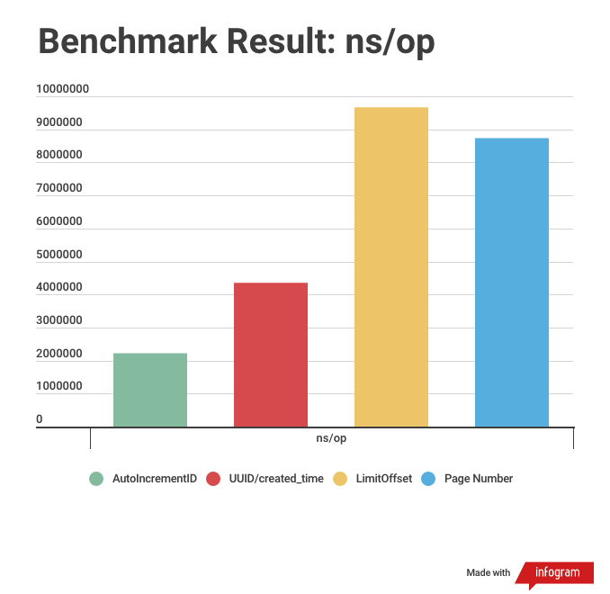

# go-postgres-pagination-example
An example project for pagination in Postgres with Golang 


This repostiory based on this article https://medium.com/easyread/how-to-do-pagination-in-postgres-with-golang-in-4-common-ways-12365b9fb528

### Pagination List 
 
 - Offset based pagination
    - [Using Page Number](/pagenumber)
    - [Using Limit and Offset Query Param](/offsetlimit)
 - Cursor based pagination
    - [Using auto-increment ID](/autoincrementid)
    - [Using keyset, (uuid + created_time)](/uuidcreatedtime) 


### Run all the applications

```bash
$ make run

$ docker ps
# ensure all the API is running
CONTAINER ID        IMAGE                                            COMMAND                  CREATED             STATUS                       PORTS                    NAMES
0671922c90ab        postgres-pagination_offset-limit                 "/bin/sh -c /app/ole…"   14 minutes ago      Up 14 minutes                0.0.0.0:9092->9090/tcp   payment-with-offset-limit
5ee034203ad1        postgres-pagination_page-number                  "/bin/sh -c /app/pne…"   14 minutes ago      Up 14 minutes                0.0.0.0:9094->9090/tcp   payment-with-page-number
78a82fbc7815        postgres-pagination_uuid-created-time            "/bin/sh -c /app/uce…"   14 minutes ago      Up 14 minutes                0.0.0.0:9093->9090/tcp   payment-with-uuid-created-time
4a83359ac88e        postgres-pagination_auto-increment               "/bin/sh -c /app/aie…"   14 minutes ago      Up 14 minutes                0.0.0.0:9091->9090/tcp   payment-with-auto-increment-id
e46c1c6d299b        postgres-pagination_postgres-page-number         "docker-entrypoint.s…"   33 minutes ago      Up 33 minutes (healthy)      5432/tcp                 payment-with-page-number-db
fea94d4b92ef        postgres-pagination_postgres-uuid-created-time   "docker-entrypoint.s…"   About an hour ago   Up About an hour (healthy)   5432/tcp                 payment-with-uuid-created-time-db
9380e111c0eb        postgres-pagination_postgres-offset-limit        "docker-entrypoint.s…"   About an hour ago   Up About an hour (healthy)   5432/tcp                 payment-with-offset-limit-db
68c90b610f54        postgres-pagination_postgres-auto-increment      "docker-entrypoint.s…"   About an hour ago   Up About an hour (healthy)   5432/tcp                 payment-with-auto-increment-id-db
```

Call the API based on the opened port,

```bash
$ curl locahost:9091/payments
$ curl locahost:9092/payments
$ curl locahost:9093/payments
$ curl locahost:9094/payments
```

### Run Benchmark

To run benchmark for each pagination method, 

```bash
$ cd to_each_directory

$ make benchmark
```

Example,

```bash
$ cd pagenumber
$ make benchmark
```

### Benchmark Result



